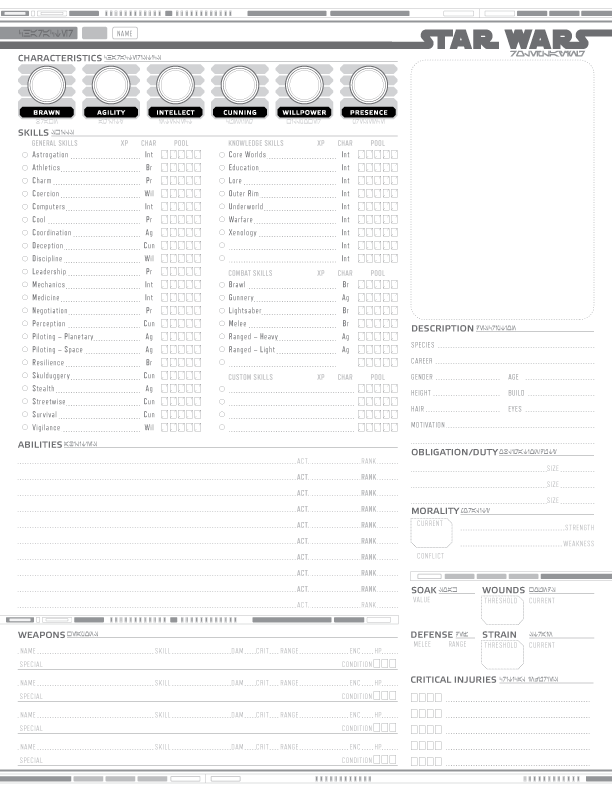
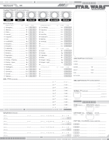
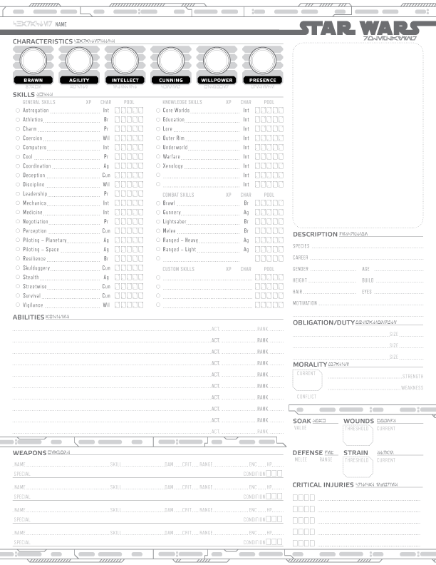
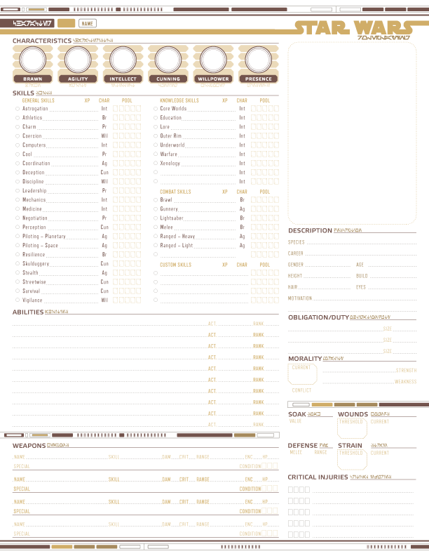
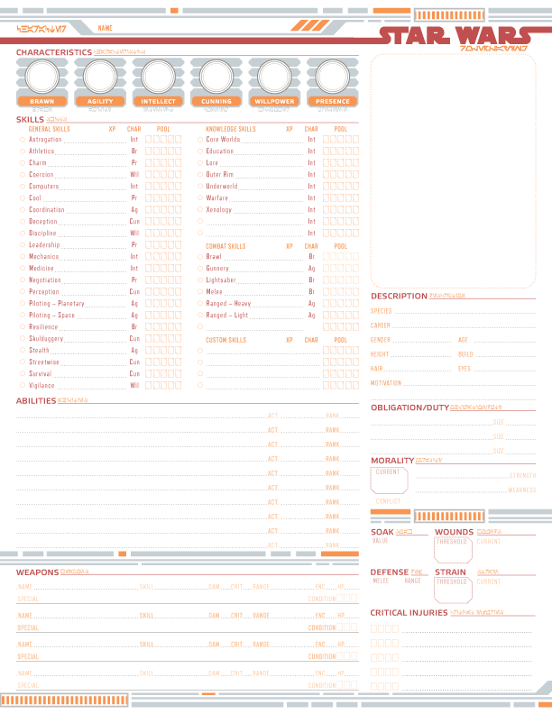
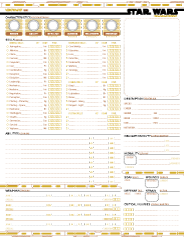
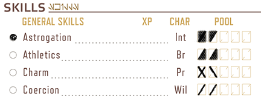
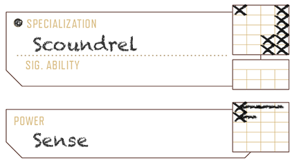

FFG Star Wars Character for Acrobat
===================================

> Custom, form-fillable, character sheets for the Star Wars Roleplaying games.

Vorwort zur deutschen Fassung
-----------------------------

Character sheets for **Edge of the Empire**, **Age of Rebellion**, and **Force
and Destiny**. 

;

In **color** too!

;

And now, **form fillable** in [Adobe Reader][reader].

Get the goodies in the [pub](./pub) directory (_form fillable versions have a
'-ff' at the end of the filename_).

### Sicherheitshinweise 

> Der Autor empfiehlt ausdrücklich, die aktuellste Version des Adobe Readers zu
> verwenden. Obwohl die Dateien auch mit anderen Readern geöffnet werden könnten,
> kann nicht garantiert werden, dass alle Felder korrekt angezeigt oder
> aber die Textfelder korrekt editierbar sein werden.

> Der Autor verwendet ausschließlich Textfelder.

> Die Felder sind nicht interaktiv.

> Dies ist der Versuch, eine möglichst flexible Handhabung zu gewährleisten.

[reader]: http://get.adobe.com/reader/ "Adode Reader"

Benutzungshilfe
---------------

### Fertigkeiten ###

* Fülle das Listensymbol (Kreis) aus, wenn die Fertigkeit eine
  Berufsfertigkeit darstellt.
* Fülle den unteren Teil der Felder für jeden Punkt aus, den Du aus der betreffenden
  Eigenschaften erhälst (z.B. Intelligenz 1). 
  [Merk-Tipp: Eigenschaft unten, weil das die "Basis" für die Fertigkeit darstellt.]
* Fülle den oberen Teil der Felder für jeden Rang aus, den Du bei der jeweiligen Fertigkeit
  erreicht hast (z.B. Astronavigation 2). 
* Auf dieser Weise kannst Du schnell erkennen, wie Dein Würfelpool zusammengesetzt ist.
  (halb gefüllt: grüner Würfel, ausgefüllt: gelber Würfel)

* Alternativ kannst Du auch einen slash ("\") für die Fertigkeit (also den Rang) und einen 
  backslash ("/") für die Eigenschaft verwenden ("X" wäre also ein gelber Würfel, "/" und
  "\" wären grüne Würfel)

### Talentbäume ###

* Setze ein 'X' in ein Feld, sobald Du das dem Talentbaum entsprechende Talentenfeld
  freigeschaltet (und das Talent erlernt) hast.
* Bei Machtbäumen und anderen Baumstrukturen, bei denen ein Talent/ eine Fertigkeit
  mehrere Zweige "freischaltet" ziehst Du einen waagerechten Strich durch die entspr.
  Felder
* Nutze die "Fähigkeiten"-Listen, um die erlernten Fähigkeiten/ Boni/ usw. festzuhalten

Internationalization (i18n)
---------------------------

* [English](./README.en.md)

In the interest of making these available to the widest possible audience, I'm
working on a way to layout my illustrator files using JavaScript.

By incorporating a simple database of strings (eg. a JavaScript file) in the
script that lays out the page I can quickly create new versions with regionlized
strings.

### Translations

The illustrator template(s) and scripts will all be available in this repository
for your own use at some point. However, until I've finished the i18n scripts and
documented the process to run the various scripts in Illustrator® and Acrobat®,
it's probably easiest for others to translate database files and I generate the
localized version.

1. Fork this repository.

2. In your fork, copy the existing 'en.js' file inside the
   [lib/i18n/strings](lib/i18n/strings) directory and name it with the
   appropriate [BCP 47](BCP47) code (find a [discussion on language tags
   here][language-tags]).

3. At the top of the file are a couple of strings that need to be changed to
   reflect the current language, and any language that it is based on.

   The first is the one right after the `new Strings(`. This one sets the
   current language name. Use a BCP 47 code (i.e: 'fr', 'fr-CA', 'en-GB',
   etc...).

   The second is the commented out `base: 'en'` line. Un-comment that line.
   Unless you are creating a more regionalized version of the strings ('fr-CA',
   from 'fr') leave it as 'en', otherwise set it to the more generic language code.

4. When you are ready, issue a pull request for me to incorporate your changes.

5. Given my schedule, I will post the resulting PDFs as soon as I can.

[language-tags]: http://www.w3.org/International/questions/qa-choosing-language-tags
[BCP47]: https://tools.ietf.org/html/bcp47

Report an Issue
---------------

* [Bugs](http://github.com/jhamlet/ffg-swchar-acro/issues)
* Contact the author: <jerry@hamletink.com>

License
-------

> Copyright (c) 2014 Jerry Hamlet <jerry@hamletink.com>
> 
> Star Wars and all related terms are the registered trademarks of LucasFilm
> Limited, its associated bodies, and the Disney Corporation. Edge of the
> Empire, the dice symbols, and associated rules terminology are the property of
> Fantasy Flight Games. As such, the author of this document makes no claim of
> ownership to any of the afore-mentioned material.
> 
> Permission is hereby granted, free of charge, to any person obtaining a copy of
> this software and associated documentation files (the "Software"), to deal in
> the Software without restriction, including without limitation the rights to
> use, copy, modify, merge, publish, distribute, sublicense, and/or sell copies of
> the Software, and to permit persons to whom the Software is furnished to do so,
> subject to the following conditions:
> 
> The above copyright notice and this permission notice shall be included in all
> copies or substantial portions of the Software.
> 
> The Software shall be used for Good, not Evil.
> 
> THE SOFTWARE IS PROVIDED "AS IS", WITHOUT WARRANTY OF ANY KIND, EXPRESS OR
> IMPLIED, INCLUDING BUT NOT LIMITED TO THE WARRANTIES OF MERCHANTABILITY, FITNESS
> FOR A PARTICULAR PURPOSE AND NONINFRINGEMENT. IN NO EVENT SHALL THE AUTHORS OR
> COPYRIGHT HOLDERS BE LIABLE FOR ANY CLAIM, DAMAGES OR OTHER LIABILITY, WHETHER
> IN AN ACTION OF CONTRACT, TORT OR OTHERWISE, ARISING FROM, OUT OF OR IN
> CONNECTION WITH THE SOFTWARE OR THE USE OR OTHER DEALINGS IN THE SOFTWARE.
> 
