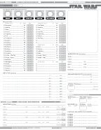
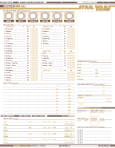
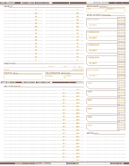
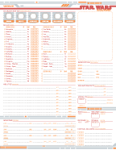
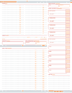
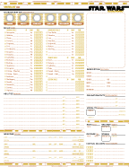
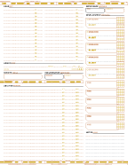

FFG Star Wars Character for Acrobat
===================================

> Custom character sheets for the Star Wars Roleplaying games.

Summary
-------

The original gray **Edge of the Empire** styled character sheet.

**_Now in color!_**

And new styles for **Age of Rebellion** and **Force and Destiny**.

These also have versions in _gray_.

Get the goodies in the [pub](./pub) directory.

Usage
-----

### Skills ###

#### Skill Circle ####
Fill in the circle if it is a _career_ skill.

#### Skill Pool ####
* Fill the bottom triangle of the _pool_ box for each rank of a
  characteristic you have for that skill
* Fill in the top part when you get a rank.
* This way you can read it as 'filled', 'filled', 'half' equals
  'proficiency', 'proficiency', 'ability' (or for the color obsessed 'yellow',
  'yellow', 'green').
* _Alternatively_ you can use a slash for ability, and an opposite slash (which
  makes an 'X') to indicate ability/proficiency.

### Development Trees ###

* Put an 'X' in the box if you have purchased that column/row of the tree.
* For powers, and other trees where an ability spans multiple columns, put a
  line through the relevant boxes.

Report an Issue
---------------

* [Bugs](http://github.com/jhamlet/ffg-swchar-acro/issues)
* Contact the author: <jerry@hamletink.com>

License
-------

> Copyright (c) 2014 Jerry Hamlet <jerry@hamletink.com>
> 
> Star Wars and all related terms are the registered trademarks of LucasFilm
> Limited, its associated bodies, and the Disney Corporation. Edge of the
> Empire, the dice symbols, and associated rules terminology are the property of
> Fantasy Flight Games. As such, the author of this document makes no claim of
> ownership to any of the afore-mentioned material.
> 
> Permission is hereby granted, free of charge, to any person obtaining a copy of
> this software and associated documentation files (the "Software"), to deal in
> the Software without restriction, including without limitation the rights to
> use, copy, modify, merge, publish, distribute, sublicense, and/or sell copies of
> the Software, and to permit persons to whom the Software is furnished to do so,
> subject to the following conditions:
> 
> The above copyright notice and this permission notice shall be included in all
> copies or substantial portions of the Software.
> 
> The Software shall be used for Good, not Evil.
> 
> THE SOFTWARE IS PROVIDED "AS IS", WITHOUT WARRANTY OF ANY KIND, EXPRESS OR
> IMPLIED, INCLUDING BUT NOT LIMITED TO THE WARRANTIES OF MERCHANTABILITY, FITNESS
> FOR A PARTICULAR PURPOSE AND NONINFRINGEMENT. IN NO EVENT SHALL THE AUTHORS OR
> COPYRIGHT HOLDERS BE LIABLE FOR ANY CLAIM, DAMAGES OR OTHER LIABILITY, WHETHER
> IN AN ACTION OF CONTRACT, TORT OR OTHERWISE, ARISING FROM, OUT OF OR IN
> CONNECTION WITH THE SOFTWARE OR THE USE OR OTHER DEALINGS IN THE SOFTWARE.
> 
